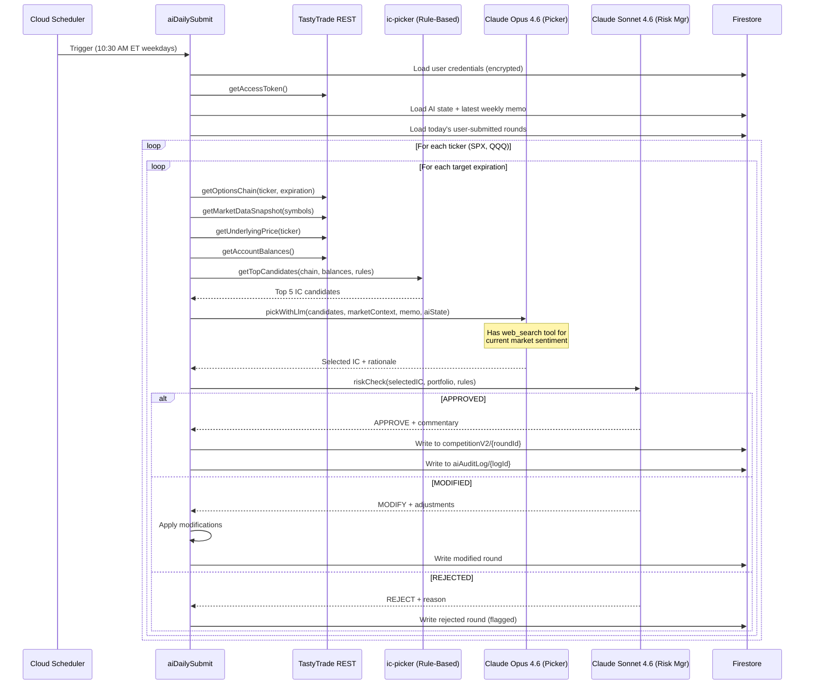
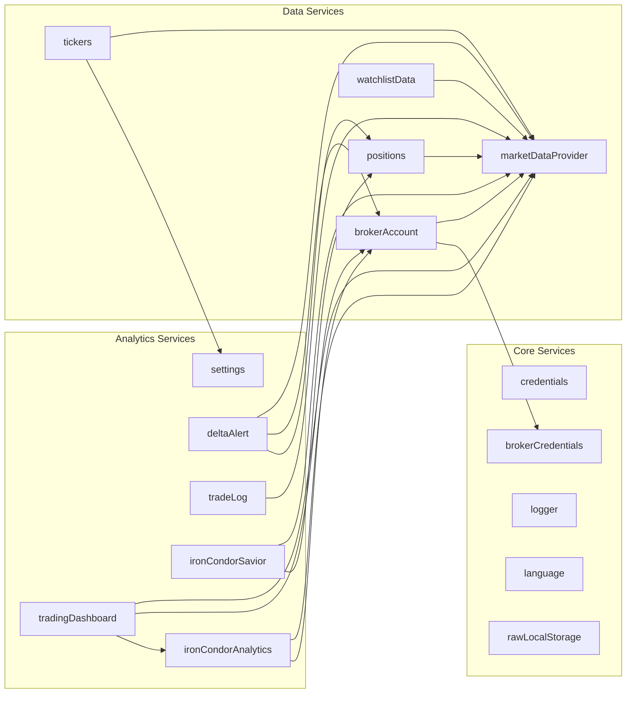

# System Architecture

> Component diagrams, data flows, and Firestore schema for TastyScanner. Includes Mermaid diagrams for visual reference.

## High-Level Architecture

The system consists of three layers:

1. **Browser** -- React 19 + Ionic 8 SPA hosted on Firebase Hosting. Connects directly to Firestore for read/write and to DxLink WebSocket for real-time market data streaming.
2. **Firebase Cloud Functions** -- Express API for credential management and Polygon proxy. Scheduled functions for autonomous AI trading (daily picks, close checks, weekly reflection). Firestore-triggered learning pipeline.
3. **External Services** -- TastyTrade REST + DxLink WebSocket, Anthropic Claude API, Polygon.io historical data.

### Component Diagram

```mermaid
graph TB
    subgraph Browser["Browser (React 19 + Ionic 8)"]
        SF[ServiceFactory]
        MDP[MarketDataProvider]
        BA[BrokerAccount]
        ICA[IronCondorAnalytics]
        TD[TradingDashboard]
        POS[Positions]
        DA[DeltaAlert]
        TL[TradeLog]
        ICS[IronCondorSavior]
        WLD[WatchlistData]
        TICK[Tickers]
        SET[Settings]
        CRED[Credentials]
        BCRED[BrokerCredentials]
        LANG[Language]
        LOG[Logger]
        RLS[RawLocalStorage]

        SF --> MDP
        SF --> BA
        SF --> ICA
        SF --> TD
        SF --> POS
        SF --> DA
        SF --> TL
        SF --> ICS
        SF --> WLD
        SF --> TICK
        SF --> SET
        SF --> CRED
        SF --> BCRED
        SF --> LANG
        SF --> LOG
        SF --> RLS
    end

    subgraph Firebase["Firebase (GCP us-east1)"]
        FS[(Firestore)]
        AUTH[Firebase Auth]
        HOST[Firebase Hosting]
        FN_API[api Function\nExpress]
        FN_DAILY[aiDailySubmit\n10:30 AM ET]
        FN_CLOSE[closeCheck\n4:00 PM ET]
        FN_LEARN[aiLearning\nFirestore trigger]
        FN_REFLECT[weeklyReflect\nSun 8 PM ET]
    end

    subgraph External["External Services"]
        TT_REST[TastyTrade REST API]
        DX_WS[DxLink WebSocket\nReal-time Greeks/Quotes]
        CLAUDE[Anthropic Claude API\nOpus 4.6 + Sonnet 4.6]
        POLY[Polygon.io\nHistorical Data]
    end

    Browser -->|Auth tokens| AUTH
    Browser -->|Read/Write| FS
    MDP -->|WebSocket| DX_WS
    MDP -->|REST| TT_REST
    Browser -->|HTTPS| FN_API
    HOST -->|Serves| Browser

    FN_API -->|Proxy| POLY
    FN_API -->|Encrypted creds| FS
    FN_DAILY -->|Pick IC| CLAUDE
    FN_DAILY -->|Options chain| TT_REST
    FN_DAILY -->|Write rounds| FS
    FN_CLOSE -->|Market data| TT_REST
    FN_CLOSE -->|Update rounds| FS
    FN_LEARN -->|Read/Write| FS
    FN_REFLECT -->|Strategy memo| CLAUDE
    FN_REFLECT -->|Write memos| FS
```



## Multi-Agent Flow (aiDailySubmit)

The daily AI IC picker runs a multi-agent pipeline every weekday at 10:30 AM ET. The flow processes each ticker (SPX, QQQ) across available expirations.



## Frontend Service Dependency Graph

All services are accessed through `ServiceFactory`. Services that depend on other services receive the factory reference and access siblings through it.



## Daily Round Lifecycle

End-to-end flow of a competition round from submission to learning:

**10:30 AM ET** -- `aiDailySubmit` fires:
1. Load encrypted TastyTrade credentials from Firestore, exchange for access token
2. Load AI state (exploration rate, rule adjustments, weights) from `users/{uid}/aiState/current`
3. Load latest weekly memo from `aiState/current/weeklyMemos/`
4. Check what expirations Catalin has submitted for today (union with ghost-mode expirations)
5. For each ticker + expiration: fetch options chain, run rule-based picker, call Claude Opus, call Claude Sonnet
6. Write round to `users/{uid}/competitionV2/{roundId}` with status `Open`

**4:00 PM ET** -- `closeCheck` fires:
1. Load all `Open` rounds from `competitionV2`
2. For each AI virtual trade: check current option prices via TastyTrade snapshots
   - Close if unrealized profit >= 75% of max profit
   - Close if DTE <= 10
   - Close if expired (DTE <= 0)
3. For each user trade: scan TastyTrade transaction history for matching closing orders
4. When both AI and user sides are resolved: compute scores (`exitPl / maxLoss`), set winner (AI/User/Draw/GhostOnly)
5. Update round in Firestore

**On round close (Firestore trigger)** -- `aiLearning` fires:
1. Detect winner change from `Pending` to `AI`/`User`/`Draw`
2. Extract feature vector: ticker, wings, DTE at entry, short put/call delta, POP, credit ratio, EV, VIX, IVR, days held, close reason, experiment variant
3. Update rule adjustments (increase/decrease thresholds based on win/loss outcomes)
4. Update exploration weights in `aiState/current`
5. Write entry to `users/{uid}/learningLog/{logId}`

**Sunday 8 PM ET** -- `weeklyReflect` fires:
1. Read all rounds from the past 7 days
2. Read learning log entries and current AI state
3. Compose a prompt with performance summary, feature vector trends, and rule adjustment history
4. Claude Opus writes a strategy memo analyzing what worked, what failed, and recommended adjustments
5. Store memo in `aiState/current/weeklyMemos/{weekId}`

## Firestore Schema

```
users/{uid}
├── (user profile fields: updatedAt)
│
├── brokerAccounts/{accountId}
│   ├── brokerType: "TastyTrade" | "IBKR"
│   ├── credentials: { clientSecret, refreshToken } (encrypted ref)
│   ├── isActive: boolean
│   └── createdAt: Timestamp
│
├── competitionV2/{roundId}
│   ├── date: "2026-04-13"
│   ├── ticker: "SPX" | "QQQ"
│   ├── expiration: "2026-04-18"
│   ├── ghost: boolean (true if no user submission for this expiration)
│   ├── winner: "Pending" | "AI" | "User" | "Draw" | "GhostOnly"
│   ├── userScore: number | null
│   ├── aiScore: number | null
│   ├── marketContext: { vix, ivRank, underlyingPrice }
│   ├── aiTrade: { legs[], credit, maxLoss, wings, pop, ev, delta,
│   │              expiration, entryPrice, exitPrice, exitPl, exitDate,
│   │              closedBy, experimentVariant, rationale, riskVerdict }
│   ├── userTrade: { legs[], credit, maxLoss, ... } | null
│   └── createdAt: Timestamp
│
├── competition/{roundId}         (legacy v1 -- retained for history)
│
├── aiState/current
│   ├── explorationRate: number (0-1)
│   ├── weights: { ... }
│   ├── ruleAdjustments: IRuleAdjustment[]
│   ├── updatedAt: Timestamp
│   └── weeklyMemos/{weekId}
│       ├── weekId: "2026-W15"
│       ├── memoText: string (Claude's strategy analysis)
│       ├── roundsSummary: { wins, losses, draws, totalPl }
│       └── createdAt: Timestamp
│
├── aiAuditLog/{logId}
│   ├── model: "claude-opus-4-6" | "claude-sonnet-4-6"
│   ├── purpose: "picker" | "risk-manager" | "reflector"
│   ├── inputTokens: number
│   ├── outputTokens: number
│   ├── costUsd: number
│   ├── durationMs: number
│   └── createdAt: Timestamp
│
├── learningLog/{logId}
│   ├── roundId: string
│   ├── outcome: "win" | "loss" | "draw" | "vetoed"
│   ├── featureVector: IFeatureVector
│   └── createdAt: Timestamp
│
└── ibkrTokens/current
    ├── encryptedAccessToken: string
    ├── accessTokenIv: string
    ├── encryptedRefreshToken: string | null
    ├── refreshTokenIv: string | null
    └── updatedAt: Timestamp

credentials/{uid}                  (top-level, for legacy TastyTrade creds)
├── encryptedClientSecret: string
├── encryptedRefreshToken: string
├── iv: string (secretIv:tokenIv)
└── updatedAt: Timestamp
```

## Critical Patterns

### Portfolio Greeks Aggregation (autorun)

The `BrokerAccountService` uses MobX `autorun` to reactively re-compute portfolio-level Greeks whenever individual position Greeks update from the WebSocket streamer. The pattern:

1. `MarketDataProvider.start()` opens DxLink WebSocket
2. Positions are loaded, and each position's `streamerSymbol` is subscribed for Greeks/quotes
3. Incoming WebSocket data updates observable Maps in `MarketDataProvider`
4. `autorun` in `BrokerAccountService` detects the Map mutations and re-aggregates portfolio delta, theta, gamma, vega
5. Components wrapped in `observer()` re-render with new aggregated values

### Symbol Format Mapping

TastyTrade REST API and DxLink WebSocket use different symbol formats. The mapping is handled at the data boundary:

- `pos['streamer-symbol']` from TastyTrade API is mapped to `streamerSymbol` in the frontend model
- All WebSocket subscriptions use `streamerSymbol`
- Display can use either format depending on context

See [Code Standards](code-standards.md) for details on this critical convention.

### Net Liquidity Reconstruction

Net liquidity history is not available directly from TastyTrade. It is reconstructed from transaction history:

```
startNetLiq = currentNetLiq - totalCumulativePL
For each transaction point:
  netLiq = startNetLiq + cumulativePLAtThatPoint
```

This runs in `TradingDashboardService` and produces the data for the net liquidity chart on the Dashboard page.

## Security Model

### Firestore Rules (`firestore.rules`)

User isolation is enforced at the Firestore level. Each user can only read/write their own document and subcollections:

```
match /users/{userId} {
    allow read, write: if request.auth != null && request.auth.uid == userId;
}
match /users/{userId}/{subcollection=**} {
    allow read, write: if request.auth != null && request.auth.uid == userId;
}
// Deny everything else
match /{document=**} {
    allow read, write: if false;
}
```

### Firebase Auth

- Email/password authentication
- Custom claims for RBAC: `role: 'superadmin'` enables admin-only API endpoints (e.g., `/api/admin/users`)
- Superadmin created via `functions/scripts/create-superadmin.js`

### Credential Encryption

Broker credentials are encrypted server-side with AES-256-GCM before storage in Firestore:
- `ENCRYPTION_KEY` (64-char hex = 32 bytes) stored as a Firebase Secret
- Each credential pair gets a unique IV
- The `api` function handles encrypt/decrypt; the browser never sees the encryption key

### Firebase Hosting Security Headers

Configured in `firebase.json`:
- `X-Content-Type-Options: nosniff`
- `X-Frame-Options: DENY`
- `Strict-Transport-Security: max-age=31536000; includeSubDomains`
- `Referrer-Policy: strict-origin-when-cross-origin`
- `Permissions-Policy: camera=(), microphone=(), geolocation=()`
- `Content-Security-Policy` with restricted `connect-src` to TastyTrade, Firebase, IBKR, and Polygon.io domains

### CORS Policy

The Express `api` function restricts origins to:
- `https://operatiunea-guvidul.web.app`
- `https://operatiunea-guvidul.firebaseapp.com`
- `http://localhost:5173` (dev)
- `http://localhost:5174` (dev alternate)

### Claude API Budget Control

The `llm-client.ts` module tracks daily spend via `aiAuditLog` entries and enforces a configurable budget cap (default: $10/day). If the cap is exceeded, `BudgetExceededError` is thrown and the function aborts gracefully.

## See Also

- [Codebase Summary](codebase-summary.md) -- File-level inventory of services and functions
- [Code Standards](code-standards.md) -- TypeScript and MobX conventions
- [Deployment Guide](deployment-guide.md) -- How to deploy functions and hosting
- [Project Overview & Roadmap](project-overview-pdr.md) -- Feature descriptions and roadmap

---

*Last updated: 2026-04-13*
